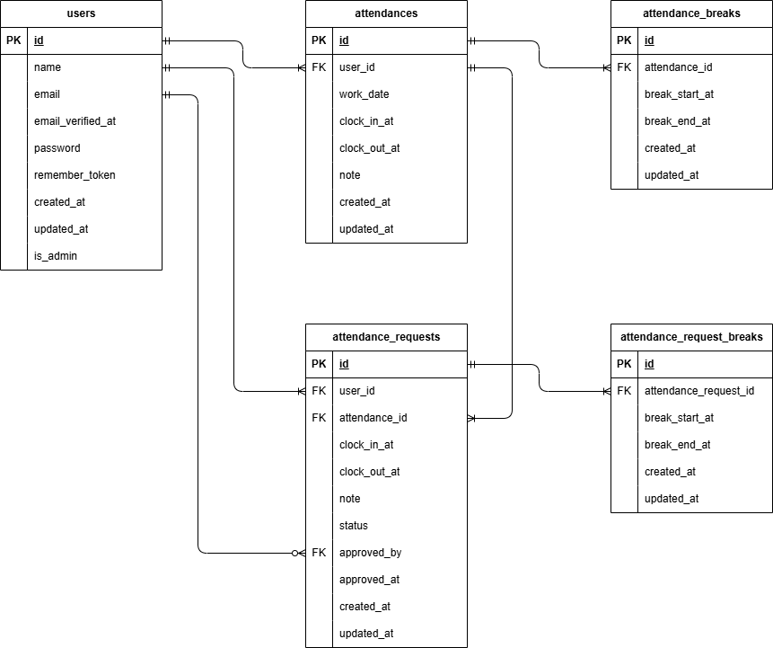

# coachtech-attendance

勤怠管理の基本機能を実装したWebアプリケーションです。

---

## 環境構築

### Dockerビルド

1. リポジトリをクローン
```
git clone git@github.com:furamomo/coachtech-attendance.git
```


2. DockerDesktopアプリを起動

3. コンテナの作成・起動
```
docker-compose up -d --build
```

---

### Laravel環境構築

1. PHPコンテナに入る
```
docker-compose exec php bash
```

2. storage・キャッシュ用ディレクトリの作成と権限付与
```
mkdir -p storage/framework/cache/data
mkdir -p storage/framework/sessions
mkdir -p storage/framework/views
mkdir -p bootstrap/cache

chmod -R 775 storage
chmod -R 775 bootstrap/cache
```

3. Composerのインストール
```
composer install
```

4. 環境ファイル作成
```
cp .env.example .env
```

5..envに以下を設定
```
DB_CONNECTION=mysql
DB_HOST=mysql
DB_PORT=3306
DB_DATABASE=attendance_db
DB_USERNAME=attendance_user
DB_PASSWORD=attendance_pass
```

6.アプリケーションキーの作成
```
php artisan key:generate
```

7.マイグレーションの実行
```
php artisan migrate
```

8.シーディングの実行
```
php artisan db:seed
```

---

## 使用技術（実行環境）

- PHP 8.1.34
- Laravel 8.83.29
- MySQL 8.0.26
- nginx 1.21.1
- phpMyAdmin
- MailHog
- Docker / Docker Compose


---

## ER図



---

## URL

- 会員登録：http://localhost/register
- ログイン：http://localhost/login
- 管理者ログイン：http://localhost/admin/login
- phpMyAdmin：http://localhost:8080/
- MailHog：http://localhost:8025/

---

## 機能概要

- 会員登録・ログイン・管理者ログイン（Fortify）
- メール認証（verified）

- 一般ユーザー
  - 勤怠打刻（出勤 / 休憩 / 退勤）
  - 勤怠一覧
  - 勤怠詳細（修正申請）
  - 申請確認

- 管理者
  - 日時勤怠
  - 勤怠詳細（直接修正）
  - スタッフ情報（一覧 / 月次勤怠）
  - 申請一覧
  - 申請承認

## 追加実装（UI/UX改善）

- 勤怠一覧
  - 未来日の「詳細」ボタンを押せない状態にし、詳細画面へ遷移できないようにしている
  - 申請状態を表示する列を追加し、修正申請の状況を確認できるようにしている

- 勤怠詳細
  - 勤怠の打刻忘れや勤怠データが存在しない日でも修正申請できるようにしている
  - 当日かつ退勤していない場合は修正申請できないようにしている

- 日次勤怠
  - 未来日の「詳細」ボタンを押せない状態にし、詳細画面へ遷移できないようにしている
  - 勤怠データが存在しない場合でも全ユーザーを表示し、誰が出勤しているか一目で確認できるようにしている
